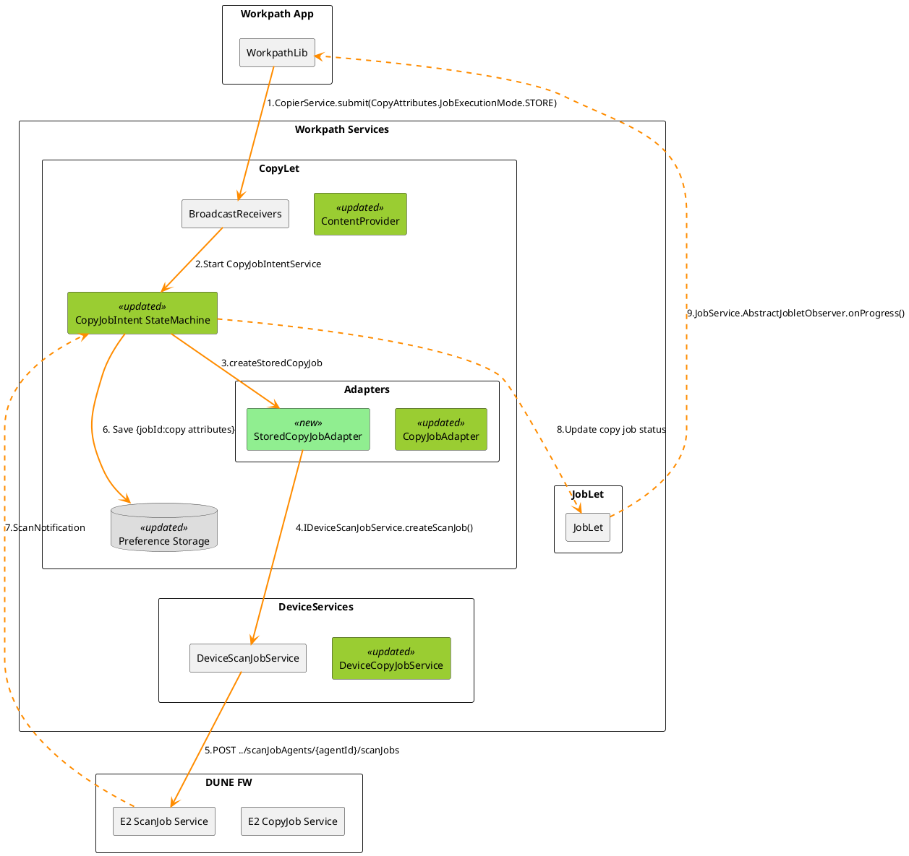
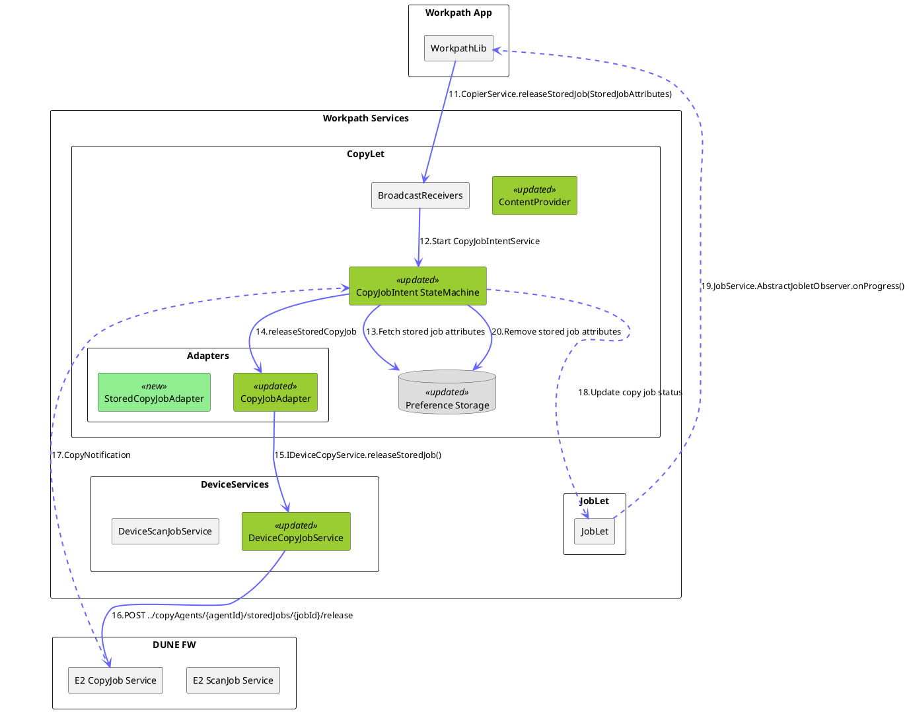
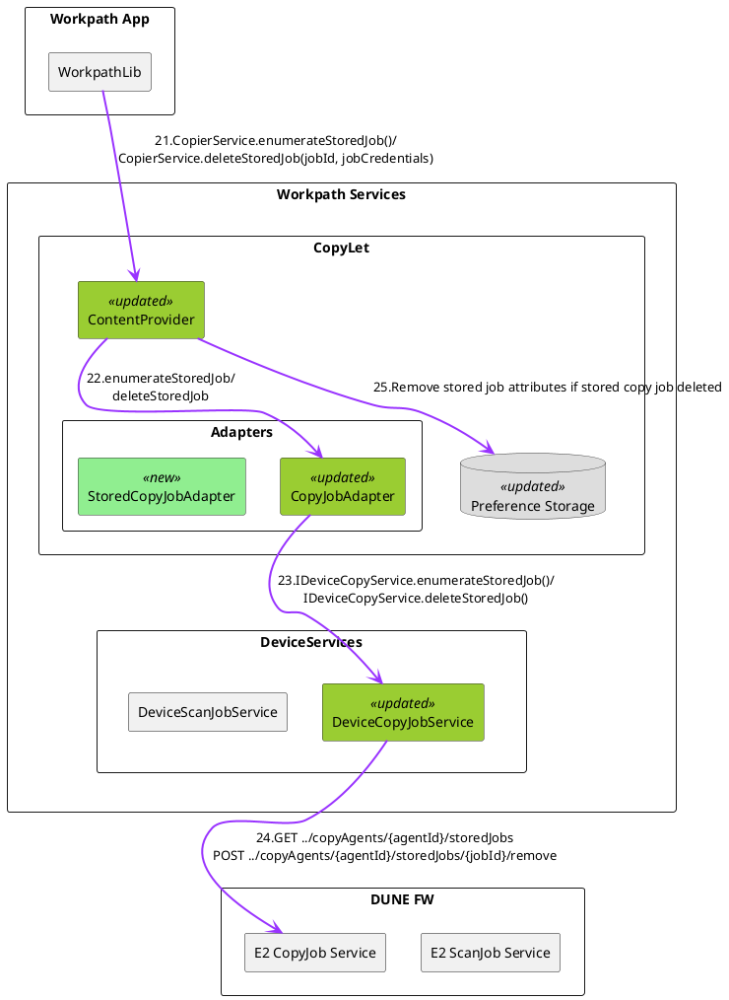

# DUNE-169955: Workpath Stored Copy Job

## 1. Scope
**Stored Copy Job for Workpath Apps**
1.  Create a stored copy job
2.  Enumerate stored copy jobs
3.  Release a stored copy job
4.  Delete a stored copy job
5.  Notify the app of the job state and job data for a stored copy job
6.  Retrieve copy options capabilities (profiles)
7.  Retrieve copy default options
---

## 2. Background & Workpath Impact

### Dune and E2 Design
*   **Dune Approach:** Generic re-flow mechanism. Stored scans can be released as Copy, Email, Folder, Fax, etc.
*   **E2 Refactored Design:** Fully separated "scan" vs "copy" settings for stored copy jobs.

### Workpath Impact
**Creating Stored Copy Jobs**
*   Register **E2 Scan Job Agent** during app installation.
*   Use E2 Scan Agent API to create `ScanJob` with `JobStorage` destination.
*   Abstract internal mechanics by converting Dune/E2 scan job to Workpath copy job, ensuring the app recognizes it as a stored copy job for backward compatibility.
*   Store the request copy options with the created stored job ID to use when releasing the stored job.

**Managing Stored Copy Jobs**
*   Register **E2 Copy Job Agent** during app installation.
*   Use E2 Copy Agent API to enumerate, release, and delete stored scan jobs.

**Retrieving Default Copy Options & Profiles**
*   **Existing Workpath API:** No distinction between Standard and Stored Copy. Provides a single set of Copy Options (E2 base copy option profile only).
*   **Future Extension:**
    *   *Standard Copy Job options:* E2 base copy option profile.
    *   *Stored Copy Job options:* Scan options (E2 `jobStorage` scan option profile) + Copy options (E2 stored copy option profile).

---

## 3. Design Options: Create Stored Copy Job

### Option 1: Separation of Concerns
*   **Mechanism:** Delegate the "Scan to `JobStorage`" operations to the Scan Service.
*   **Flow:** Scan `JobInfo` -> Copy `JobInfo` / Copy Attributes -> Scan Attributes.
*   **Pros:**
    *   Aligns with DUNE/E2 architectural principles.
    *   Enforces separation between Scan and Copy jobs.
*   **Cons:**
    *   Increased complexity in the Scan Service for Copy jobs.
    *   Requires Scan Service to know Copy options for compatibility.
    *   Risk of Scan Service becoming dependent on Copy Service.

### Option 2: Centralized Logic (Selected)
*   **Mechanism:** The Copy Service manages the workflow by adding a new job state machine for "Scan to `JobStorage`".
*   **Flow:** Centralizes copy-related logic within the Copy Service (`JobId`: stored copy options).
*   **Pros:**
    *   Centralizes copy-related logic within the Copy Service.
    *   Simplifies backward compatibility handling as the Copy Service already manages Copy `JobInfo`.
*   **Cons:**
    *   Code duplication: Scan job state machine logic is repeated in both Scan and Copy Services.
    *   Limits flexibility for future 'Release Stored Scan Job' extensions to Http/Folder/Email in E2.

---

## 4. Workpath Copy Service Detail Design

## 4.1 Component Definitions

This section describes each component in the architecture diagram and its responsibilities.

### 4.1.1 Workpath App

| Component | Description |
|-----------|-------------|
| **WorkpathLib** | • The Workpath SDK library that provides the Workpath API for applications<br>• Exposes `CopierService` APIs for creating, releasing, enumerating, and deleting stored copy jobs<br>• Provides `JobService.AbstractJobletObserver` for receiving job status notifications<br>• Abstracts the underlying device communication from the application |

### 4.1.2 Workpath Services

Workpath Services is a pre-installed APK in the Workpath platform that provides Workpath API services to applications. It receives app requests through Android IPC mechanisms (BroadcastReceivers for asynchronous operations and ContentProviders for synchronous queries) and processes them by communicating with the DUNE firmware platform.

#### 4.1.2.1 CopyLet

An internal module within the Workpath Services platform that provides copy services to Workpath Apps. It receives copy-related requests from Workpath Apps and manages copy operations by interacting with E2 copy agent services.

| Component | Responsibilities |
|-----------|-----------------|
| **BroadcastReceivers** | • Receives intents from WorkpathLib for job submission and release operations<br>• Acts as the entry point for asynchronous job operations (create, release)<br>• Delegates requests to the CopyJobIntentService |
| **ContentProvider** (Updated) | • Handles synchronous query operations for retrieving copy capabilities and default options<br>• Handles synchronous query operations for enumerating and deleting stored jobs<br>• Provides a content provider interface for job management operations<br>• Returns results directly without asynchronous processing |
| **CopyJobIntent StateMachine** (Updated) | • Manages the complete lifecycle of copy jobs through state transitions<br>• Handles both standard copy jobs and stored copy jobs<br>• Coordinates between adapters, storage, and notification mechanisms<br>• Monitors E2 job status and translates it to Workpath copy job status |
| **Preference Storage** (Updated) | • Persists the mapping between job IDs and copy attributes<br>• Stores copy settings for stored jobs to be used during release |

**Adapters**

The Adapters convert data types between Workpath API and E2 API, translating app requests into E2 copy agent service calls for device firmware interaction.

| Adapter | Responsibilities |
|---------|------------------|
| **StoredCopyJobAdapter** (New) | • Specifically handles the creation of stored copy jobs<br>• Converts Workpath stored copy job creation requests to E2 scan job requests with JobStorage destination<br>• Translates Workpath copy attributes to E2 scan job options<br>• Bridges the conceptual gap between copy and scan operations |
| **CopyJobAdapter** (Updated) | • Handles create operations for standard copy jobs<br>• Handles release, enumerate, and delete operations for stored copy jobs<br>• Converts Workpath API data types to E2 API data types<br>• Creates E2 copy job tickets for releasing stored jobs |

#### 4.1.2.2 JobLet

| Component | Responsibilities |
|-----------|------------------|
| **JobLet** | • Centralized job notification manager across all job types (Copy, Scan, Email, etc.)<br>• Acts as a shared service component that receives job status updates from multiple service modules (CopyLet, ScanLet, etc.)<br>• Notifies WorkpathLib observers of job progress<br>• Provides unified job tracking interface for the Workpath platform |

#### 4.1.2.3 DeviceServices

DeviceServices is an abstraction layer for device service features used by other Workpath service modules. It interfaces with the DUNE firmware platform via E2 public REST API, E2 internal WorkpathInterop REST API, and E2 internal WorkpathInterop websocket channel.

| Service | Responsibilities |
|---------|------------------|
| **DeviceScanJobService** | • Communicates with E2 ScanJob Agent via REST API<br>• Creates scan-to-JobStorage jobs for stored copy operations<br>• Provides abstraction over E2 scan job services |
| **DeviceCopyJobService** (Updated) | • Communicates with E2 Copy Agent via REST API<br>• Releases stored copy jobs with specified copy settings<br>• Enumerates and deletes stored jobs<br>• Provides abstraction over E2 copy job services |

### 4.1.3 DUNE Firmware Platform

#### E2 Services
DUNE extensibility 2.0 services
| Service | Responsibilities |
|---------|------------------|
| **E2 ScanJob Service** | • Device firmware extensibility service that manages scan operations<br>• Handles scan-to-JobStorage job creation and execution<br>• Sends scan job status notifications via websocket AppChannel for Workpath notification target<br>• Stores scanned documents in the device's job storage |
| **E2 CopyJob Service** | • Device firmware service that manages copy operations<br>• Handles stored job release, enumeration, and deletion<br>• Sends copy job status notifications via websocket AppChannel<br>• Executes copy jobs with specified settings |

---

## 4.2 Create Stored Copy Job
This diagram illustrates the detailed interaction flow for creating a stored copy job.




**Step 1: Job Submission**
The Workpath application initiates the stored copy job creation by calling the `CopierService.submit()` Workpath API with the `CopyAttributes.JobExecutionMode.STORE` parameter. This signals that the job should be stored rather than executed immediately.

**Step 2: Activation of Copy Job Intent Service and State Machine**
The BroadcastReceiver receives the submission request and starts the `CopyJobIntentService`, which manages the job lifecycle through a state machine.

**Step 3: Adapter Selection**
When the state machine starts, it analyzes the request parameters, performs initialization tasks for job creation, and then selects the appropriate adapter for the job to be created.
The `CopyJobIntent StateMachine` delegates the stored copy job creation to the `StoredCopyJobAdapter`, which is specifically designed to handle stored copy job operations.

**Step 4: Scan Job Creation**
The `StoredCopyJobAdapter` converts the copy job attributes from Workpath API data types to E2 API data types for scan job options, and then creates an E2 scan job ticket with a JobStorage destination.
The `StoredCopyJobAdapter` calls the `IDeviceScanJobService.createScanJob()` method to create a scan job with the job ticket. This is an abstraction where a copy job is internally implemented as a scan job with a JobStorage destination.

**Step 5: E2 API Request**
The `DeviceScanJobService` sends a POST request to the E2 scanJobAgents endpoint to create the actual scan-to-jobStorage job in the device firmware.

**Step 6: Persistence**
Once the job is created, the `CopyJobIntent StateMachine` persists the job ID and associated copy attributes in the Preference Storage. This mapping is crucial for later releasing the stored job with the correct copy settings.

**Step 7: Notification Reception**
The E2 ScanJob Service sends scan job status notifications back to Workpath as the scan progresses via the websocket AppChannel.

**Step 8: Status Translation**
The state machine continuously monitors the E2 scan job status and converts it into Workpath copy job status, then notifies the JobLet component, which manages the job lifecycle across different job types. This is an abstraction where the internal scan job is translated to a stored copy job for the Workpath app.

**Step 9: Observer Notification**
The JobLet notifies the application through the `JobService.AbstractJobletObserver.onProgress()` callback, allowing the app to track the stored copy job progress.

---

## 4.3 Release a Stored Copy Job
This diagram illustrates the detailed interaction flow for releasing a stored copy job.




**Step 11: Job Release Request**
The Workpath application initiates the stored copy job release by calling the `CopierService.releaseStoredJob()` Workpath API with the `StoredJobAttributes` parameter. This signals that a previously stored job should now be executed.

**Step 12: Intent Service Activation**
The BroadcastReceiver intercepts the release request and starts the `CopyJobIntentService`, which manages the job lifecycle through a state machine.

**Step 13: Attribute Retrieval**
The `CopyJobIntent StateMachine` fetches the stored job attributes from the Preference Storage using the job ID. This retrieves the copy settings that were saved during the job creation phase.

**Step 14: Adapter Selection**
The `CopyJobIntent StateMachine` delegates the stored copy job release to the `CopyJobAdapter`, which is responsible for converting data types from Workpath API to E2 API and creating an E2 ticket for releasing the stored job.

**Step 15: Copy Job Release**
The `CopyJobAdapter` calls the `IDeviceCopyService.releaseStoredJob()` method to initiate the release of the stored job with the retrieved copy attributes.

**Step 16: E2 API Request**
The `DeviceCopyJobService` sends a POST request to the E2 copy agents endpoint `../copyAgents/{agentId}/storedJobs/{jobId}/release` to execute the stored job in the device firmware with the specified copy settings.

**Step 17: Notification Reception**
The E2 CopyJob Service sends copy job status notifications back to Workpath as the copy progresses via the websocket AppChannel.

**Step 18: Status Update**
The state machine continuously monitors the E2 copy job status and updates the copy job status, then notifies the JobLet component, which manages the job lifecycle across different job types.

**Step 19: Observer Notification**
Finally, the JobLet notifies the application through the `JobService.AbstractJobletObserver.onProgress()` callback, allowing the app to track the copy job execution progress.

**Step 20: Cleanup Stored Job Attributes**
After releasing the stored copy job completes (successfully, fails, or is canceled), the `CopyJobIntent StateMachine` removes the stored job attributes from the Preference Storage. This cleanup ensures that once a stored job has been released and executed, its associated copy settings are no longer needed and can be freed from storage. This step occurs regardless of the final job state (Completed, Failed, or Canceled) to maintain consistent storage management.

This flow demonstrates how Workpath releases a stored copy job by combining the previously stored copy attributes with the E2 stored job release mechanism, maintaining the existing copy job interface for the application.

---

## 4.4 Enumerate/Delete Stored Copy Jobs
This diagram illustrates the detailed interaction flow for enumerating/deleting stored copy jobs.




**Step 21: Enumerate/Delete Request**
The Workpath application queries or deletes stored copy jobs by calling either `CopierService.enumerateStoredJob()` to retrieve the list of all stored jobs, or `CopierService.deleteStoredJob()` with job ID and credentials to remove a specific stored job.

**Step 22: Content Provider Processing**
The ContentProvider receives the enumerate or delete request, validates the input request parameters, and delegates the operation to the `CopyJobAdapter`, which handles the data type conversions from Workpath API to E2 API format.

**Step 23: Device Service Call**
The `CopyJobAdapter` calls the appropriate device service method: `IDeviceCopyService.enumerateStoredJob()` to retrieve stored jobs, or `IDeviceCopyService.deleteStoredJob()` to remove a specific stored job.

**Step 24: E2 API Request**
The `DeviceCopyJobService` sends the corresponding HTTP request to the E2 copy agents endpoint:
- For enumeration: GET request to `../copyAgents/{agentId}/storedJobs` to retrieve the list of stored jobs
- For deletion: POST request to `../copyAgents/{agentId}/storedJobs/{jobId}/remove` to delete the specified stored job

**Step 25: Cleanup Stored Job Attributes (Delete Only)**
For delete operations only, after the E2 API request completes successfully, the ContentProvider removes the stored job attributes from the Preference Storage. This ensures that the copy settings associated with the deleted stored job are cleaned up, preventing stale data accumulation. This step is skipped for enumeration operations as they do not modify the stored job state.

This flow demonstrates how Workpath provides stored copy job management capabilities through synchronous APIs, abstracting the underlying E2 REST API interactions. Unlike the create and release flows, these operations are direct query/command operations that do not require job state monitoring or notifications.

---

## 4.5 CopyJobIntentService State Machine

```
@startuml
title CopyJobIntentService State Machine for Stored Copy Jobs

skinparam state {
    BackgroundColor WhiteSmoke
    BorderColor Black
    ArrowColor DimGray
    FontSize 12
}

state "Creating Copy Job" as Creating {
    Creating : Create a job
    Creating : Acquire a WakeLock
}

state "Monitoring Copy Job" as MonitoringCopy {
    MonitoringCopy : Wait for copy job status\nUpdate job data
}

state "Monitoring Stored Copy Job" as MonitoringStored {
    MonitoringStored : Wait for scan job status\nUpdate job data
}

state "Report Error" as Error{
    Error : Report error to the App
}

state "Job Completed" as Completed {
    Completed : Emit TL_EV_JOB_COMPLETED
}

state "Job Failed" as Failed {
    Failed : Emit TL_EV_JOB_FAILED
}

state "Job Canceled" as Canceled {
    Canceled : Emit TL_EV_JOB_CANCELED
}

state "End" as End {
    End : Release WakeLock
}

[*] --> Creating

Creating --> End : param not found
Creating --> MonitoringCopy : Normal CopyJob created\nStoredCopyJob released
Creating --> MonitoringStored : StoredCopyJob created
Creating --> Error

MonitoringCopy --> Failed
MonitoringCopy --> Completed
MonitoringCopy --> Canceled

MonitoringStored --> Failed
MonitoringStored --> Completed
MonitoringStored --> Canceled

Completed --> End
Canceled --> End
Failed --> End
Error --> End

End --> [*]

note right of Creating 
Validate input parameters and create appropriate job:
 - If the request is for creating a NORMAL CopyJob or releasing a StoredCopyJob, create a CopyJob and transition to Monitoring Copy Job state
 - If the request is for creating a STORED CopyJob, create a 'scan to jobStorage' job and transition to Monitoring Stored Copy Job state
 - If an error occurs during job creation, transition to Report Error state
end note

note right of MonitoringStored 
Monitor Scan to JobStorage Job:
 - Wait for scan job status updates from E2 Scan Service
 - Update StoredCopyJob data based on scan job progress
 - Transition to Completed state when scan job succeeds
 - Transition to Failed state when scan job fails
 - Transition to Canceled state when scan job is canceled
end note

@enduml
```

### State Machine Updates for Stored Copy Job Support

**1. Creating Copy Job State**

Validates input parameters and instantiates job based on request type:
- **NORMAL copy or RELEASE stored copy**: Creates CopyJob and transitions to Monitoring Copy Job state
- **STORED copy**: Creates scan-to-jobStorage job and transitions to Monitoring Stored Copy Job state
- **Error handling**: Parameter validation or job creation failures transition to Report Error state

**2. Monitoring Copy Job State**

Monitors copy job status and waits for copy service updates:
- Handles both normal copy jobs and released stored copy jobs, updating job data accordingly
- Transitions to terminal states: Job Completed, Job Failed, or Job Canceled

**3. Monitoring Stored Copy Job State (New)**

Monitors scan-to-jobStorage job execution:
- Waits for scan job status updates from E2 Scan Service
- Updates StoredCopyJob data based on scan job progress
- Maps E2 scan job completion events to terminal states and transitions accordingly

---

## 4.6 Preference Storage Cleanup

The Preference Storage maintains the mapping between stored copy job IDs and their associated copy attributes. To prevent stale data accumulation, cleanup is required in three scenarios:

| Scenario | Trigger | Component | Timing |
|----------|---------|-----------|--------|
| **Stored Job Release** | Job execution completes (Step 20 in 4.3) | `CopyJobIntent StateMachine` | After terminal state (Completed/Failed/Canceled) |
| **Stored Job Deletion** | App explicitly deletes job (Step 25 in 4.4) | `ContentProvider` | Immediately after successful E2 delete |
| **App Uninstallation** | Workpath app is uninstalled | `CopyLet` (via `ACTION_PACKAGE_REMOVED`) | During/after uninstallation process |

- **Release cleanup**: State machine removes attributes regardless of final job state to maintain consistency
- **Delete cleanup**: ContentProvider performs synchronous cleanup before returning to app
- **Uninstall cleanup**: Need to check Jedi/Jolt whether this is required or not.

---

# 5. Story Breakdown

## 5.1 Initial Work - Scaffolding for Stored Copy Jobs
**Story Points:** 4

**Scope:
- Set up basic project structure and package organization for stored copy job feature
- Create draft flow to handle stored copy jobs
- Define placeholder states: "Creating Copy Job", "Monitoring Stored Copy Job", "Monitoring Copy Job"
- Create dummy components and classes with empty implementations:
  - `StoredCopyJobAdapter` class skeleton
  - `PreferenceStorage` interface and stub implementation
- Define interface methods with empty bodies:
  - `IDeviceScanJobService.createScanJob()` signature
  - `IDeviceCopyJobService.releaseStoredJob()` signature
  - `IDeviceCopyJobService.enumerateStoredJob()` signature
  - `IDeviceCopyJobService.deleteStoredJob()` signature
- Add placeholder methods in CopyJobIntent StateMachine for state transitions
- Create stub E2 Agent registration logic (no actual registration yet)
- Document component interfaces and expected data flow

**Related Design Sections:**
- [Section 4.1: Component Definitions](#41-component-definitions) (all subsections for understanding architecture)
- [Section 4.2: Create Stored Copy Job](#42-create-stored-copy-job) (flow overview)
- [Section 4.3: Release a Stored Copy Job](#43-release-a-stored-copy-job) (flow overview)
- [Section 4.4: Enumerate/Delete Stored Copy Jobs](#44-enumeratedelete-stored-copy-jobs) (flow overview)
- [Section 4.5: CopyJobIntentService State Machine](#45-copyjobintentservice-state-machine)

**Acceptance Criteria:**
- All dummy components and interfaces compile without errors
- State machine draft with placeholder states defined
- Design review completed

**Dependencies:** None

---

## 5.2 Implement StoredCopyJobAdapter
**Story Points:** 4

**Scope:
- Implement `StoredCopyJobAdapter.createStoredCopyJob()` method
  - Type mapping rules: Workpath `CopyAttributes` → E2 scan job options
  - Create E2 scan job ticket with JobStorage destination
  - Integrate with existing `DeviceScanJobService` for E2 API calls
  - Revisit existing `CopyTypeMapping` rules and add missing items
  - Error handling for invalid inputs and E2 API failures

**Related Design Sections:**
- [Section 4.1.2.1: CopyLet - Adapters](#4121-copylet) (StoredCopyJobAdapter)
- [Section 4.2: Create Stored Copy Job](#42-create-stored-copy-job) - Steps 3-5 (Adapter Selection, Scan Job Creation, E2 API Request)

**Acceptance Criteria:**
- Workpath CopyAttributes correctly converted to E2 scan job options
- E2 scan job ticket created with JobStorage destination
- Integration with existing DeviceScanJobService successful
- Unit tests for type conversion and adapter logic

**Dependencies:** 5.1 (Initial Work)

---

## 5.3 Update StateMachine for Create Stored Copy Job
**Story Points:** 4

**Scope:
- Update `CopyJobIntent StateMachine` for stored copy job creation
  - Add "Monitoring Stored Copy Job" state
  - State transition logic for STORE mode (Creating → Monitoring Stored Copy Job)
  - Handle E2 Scan Job notifications from WebSocket AppChannel
  - Translate E2 scan job status to Workpath copy job status
  - Integrate Preference Storage save operation (jobID:copyAttributes)
- Integrate `StoredCopyJobAdapter` with state machine
  - Call `StoredCopyJobAdapter.createStoredCopyJob()` in Creating state
  - Pass E2 scan job ID to Monitoring Stored Copy Job state
  - Handle adapter errors and transition to Error state

**Related Design Sections:**
- [Section 4.2: Create Stored Copy Job](#42-create-stored-copy-job) - Steps 2, 6-8 (State Machine, Persistence, Notifications)
- [Section 4.5: CopyJobIntentService State Machine](#45-copyjobintentservice-state-machine) (Creating state, Monitoring Stored Copy Job state)
- [Section 4.6: Preference Storage Cleanup](#46-preference-storage-cleanup) (Save operation)

**Acceptance Criteria:**
- "Monitoring Stored Copy Job" state added to state machine
- State transitions work correctly for STORE mode
- E2 scan job status correctly maps to Workpath copy job status
- Preference Storage save operation integrated
- Unit tests for state transitions and status mapping

**Dependencies:** 5.2 (StoredCopyJobAdapter)

---

## 5.4 Integrate Create Stored Copy Job Flow (E2E)
**Story Points:** 4

**Scope:
- Integrate Create Flow End-to-End (Steps 1-9 in Section 4.2)
  - Connect BroadcastReceiver to state machine for STORE mode
  - Wire up complete flow: BroadcastReceiver → StateMachine → StoredCopyJobAdapter → DeviceScanJobService → E2
  - Implement E2 scan notification handling via websocket
  - Integrate JobLet notification for stored copy job progress
  - Handle WakeLock acquisition and release for background processing
- End-to-end testing for create flow
  - Test successful scan-to-JobStorage creation
  - Test job progress notifications
  - Test error scenarios (E2 API failures, network issues)

**Related Design Sections:**
- [Section 4.2: Create Stored Copy Job](#42-create-stored-copy-job) - Complete flow (Steps 1-9)
- [Section 4.1.2.1: CopyLet - BroadcastReceivers](#4121-copylet)
- [Section 4.1.2.2: JobLet](#4122-joblet)

**Acceptance Criteria:**
- Create stored copy job flow (Steps 1-9) works end-to-end
- App receives job progress notifications via JobLet observer
- Stored job attributes (jobID:copyAttributes) persisted correctly
- WakeLock properly acquired and released
- E2E tests pass for create flow

**Dependencies:** 5.3 (StateMachine)

---

## 5.5 Implement DeviceCopyJobService for Copy Agent API
**Story Points:** 4

**Scope:
- Implement `DeviceCopyJobService` for E2 Copy Agent API integration
  - E2 REST API client for releasing stored copy jobs
  - POST to `../copyAgents/{agentId}/storedJobs/{jobId}/release`
  - GET `../copyAgents/{agentId}/storedJobs` for enumeration
  - POST `../copyAgents/{agentId}/storedJobs/{jobId}/remove` for deletion
  - E2 API request/response parsing using OXPd2 library
  - E2 authentication and copy agent ID management
  - Register for E2 copy job notifications via WebSocket AppChannel
- Implement all `DeviceCopyJobService` methods:
  - `releaseStoredJob()`: Release stored copy job with copy settings
  - `enumerateStoredJob()`: Retrieve list of stored jobs
  - `deleteStoredJob()`: Delete specific stored job
- Error handling for E2 API failures and network issues

**Related Design Sections:**
- [Section 4.1.2.3: DeviceServices - DeviceCopyJobService](#4123-deviceservices)
- [Section 4.3: Release a Stored Copy Job](#43-release-a-stored-copy-job) - Step 16 (E2 API Request for release)
- [Section 4.4: Enumerate/Delete Stored Copy Jobs](#44-enumeratedelete-stored-copy-jobs) - Step 24 (E2 API Requests)

**Acceptance Criteria:**
- `DeviceCopyJobService` successfully calls E2 Copy Agent REST APIs
- All three methods (release, enumerate, delete) implemented and tested
- WebSocket notification registration for copy jobs successful
- E2 API request/response parsing works correctly
- Unit tests for API calls and error handling

**Dependencies:** 5.1 (Initial Work)

---

## 5.6 Implement Release Stored Copy Job Flow
**Story Points:** 4

**Scope:
- Implement `CopyJobAdapter.releaseStoredCopyJob()` method
  - Extend existing `CopyJobAdapter` to support release operations
  - Create E2 copy job tickets for releasing stored jobs
  - Type conversion: Workpath API → E2 API
  - Integrate with `DeviceCopyJobService` for E2 API calls
- Update `CopyJobIntent StateMachine` for release flow
  - State transition logic for RELEASE mode
  - Handle E2 Copy Job notifications
  - Integrate Preference Storage fetch operation (retrieve copyAttributes)
  - Implement storage cleanup after terminal state (Step 20)
- Integrate Release Flow End-to-End (Steps 11-20 in Section 4.3)
  - Connect BroadcastReceiver to state machine for release requests
  - Integrate `CopyJobAdapter.releaseStoredCopyJob()` with state machine
  - Implement E2 copy notification handling via websocket
  - Integrate JobLet notification for copy job progress
  - Implement storage cleanup after Completed/Failed/Canceled states

**Related Design Sections:**
- [Section 4.1.2.1: CopyLet - Adapters (CopyJobAdapter), BroadcastReceivers](#4121-copylet)
- [Section 4.3: Release a Stored Copy Job](#43-release-a-stored-copy-job) - Complete flow (Steps 11-20)
- [Section 4.5: CopyJobIntentService State Machine](#45-copyjobintentservice-state-machine) (Monitoring Copy Job state, transitions)
- [Section 4.6: Preference Storage Cleanup](#46-preference-storage-cleanup) (Release cleanup)

**Acceptance Criteria:**
- Release stored copy job flow (Steps 11-20) works end-to-end
- Copy attributes retrieved from Preference Storage and applied correctly
- E2 copy job executed with stored copy settings
- App receives copy job progress notifications
- Storage cleanup after job completion (terminal states)
- Unit tests for release operations and storage cleanup

**Dependencies:** 5.5 (DeviceCopyJobService)

---

## 5.6 Implement Enumerate/Delete Stored Copy Jobs Flow
**Story Points:** 4

**Scope:
- Implement `CopyJobAdapter` enumerate/delete methods
  - `enumerateStoredJobs()`: E2 API integration
  - `deleteStoredJob()`: E2 API integration
  - Type conversion: Workpath API ↔ E2 API
  - Integrate with `DeviceCopyJobService` for E2 API calls
- Integrate Enumerate/Delete Flow End-to-End (Steps 21-25 in Section 4.4)
  - Connect ContentProvider to `CopyJobAdapter` for enumerate/delete operations
  - Implement synchronous query/delete handling
  - Add input validation for job ID and credentials
  - Handle E2 API errors and return appropriate error codes
  - Implement storage cleanup for delete operations (Step 25)

**Related Design Sections:**
- [Section 4.1.2.1: CopyLet - Adapters (CopyJobAdapter), ContentProvider](#4121-copylet)
- [Section 4.4: Enumerate/Delete Stored Copy Jobs](#44-enumeratedelete-stored-copy-jobs) - Complete flow (Steps 21-25)
- [Section 4.6: Preference Storage Cleanup](#46-preference-storage-cleanup) (Delete cleanup)
**Acceptance Criteria:**

- Enumerate and delete operations work synchronously
- E2 API calls successful for enumerate/delete
- Storage cleanup after successful deletion
- Error handling for invalid inputs and API failures
- Unit tests for enumerate/delete operations

**Dependencies:** 5.5 (DeviceCopyJobService)

---

## 5.8 Implement Preference Storage Cleanup
**Story Points:** 4

**Scope:
- Implement cleanup logic to synchronize Preference Storage when stored jobs are deleted from the device
- Add cleanup hooks in delete operation (Step 25 in 4.4)
- Handle various deletion scenarios (explicit delete, expiration, reboot)
- Add verification and logging

**Related Design Sections:**
- [Section 4.6: Preference Storage Cleanup](#46-preference-storage-cleanup) (Delete cleanup scenario)
- [Section 4.4: Enumerate/Delete Stored Copy Jobs](#44-enumeratedelete-stored-copy-jobs) - Step 25 (Cleanup on deletion)
- [Section 4.1.2.1: CopyLet - Preference Storage](#4121-copylet)

**Acceptance Criteria:**
- Preference Storage entries removed when stored jobs deleted from device
- Cleanup works for all deletion scenarios
- Cleanup operations logged

**Dependencies:** 5.1 (Initial Work)

---

## 5.9 QUAL: End-to-End Testing & Bug Fixes
**Story Points:** 4

**Scope:
- Create comprehensive E2E test scenarios covering all flows
- Test concurrent operations (multiple create/release/delete)
- Test error scenarios (E2 API failures, network issues, invalid inputs)
- Test storage cleanup in all three scenarios
- Performance testing for notification latency
- Fix identified bugs and edge cases

**Related Design Sections:**
- [Section 4.2: Create Stored Copy Job](#42-create-stored-copy-job) - Complete flow validation
- [Section 4.3: Release a Stored Copy Job](#43-release-a-stored-copy-job) - Complete flow validation
- [Section 4.4: Enumerate/Delete Stored Copy Jobs](#44-enumeratedelete-stored-copy-jobs) - Complete flow validation
- [Section 4.5: CopyJobIntentService State Machine](#45-copyjobintentservice-state-machine) - All state transitions
- [Section 4.6: Preference Storage Cleanup](#46-preference-storage-cleanup) - All cleanup scenarios

**Acceptance Criteria:**
- All E2E flows pass (create, release, enumerate, delete)
- Concurrent operations and error scenarios handled correctly
- No memory/WakeLock leaks
- Performance requirements met (notification latency < 1s)

**Dependencies:** 5.4, 5.6, 5.7, 5.8 (All implementation stories)

---

## Story Dependencies Flow

```
5.1 (Initial Work)
  ├─→ 5.2 (StoredCopyJobAdapter)
  │     └─→ 5.3 (StateMachine for Create)
  │           └─→ 5.4 (Create Flow E2E)
  ├─→ 5.5 (DeviceCopyJobService)
  │     ├─→ 5.6 (Release Flow: CopyJobAdapter + StateMachine)
  │     └─→ 5.7 (Enumerate/Delete Flow: CopyJobAdapter)
  └─→ 5.8 (Storage Cleanup)

5.4, 5.6, 5.7, 5.8 → 5.9 (QUAL: E2E Testing)
```

**Total Story Points:** 36 (sequential: 10 weeks) or 16 story points (parallel: 4 weeks with 5.2→5.3→5.4 parallel with 5.5→5.6, 5.5→5.7, and 5.8)